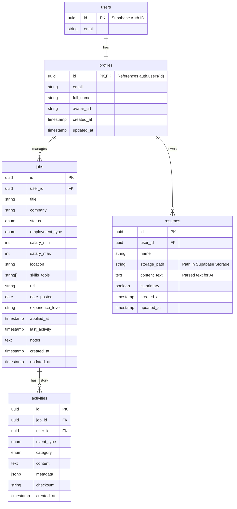

# 🗄️ Dátový Model a Správa Databázy

Tento dokument definuje schému databázy, bezpečnostné pravidlá a proces riadenia zmien pre aplikáciu JobHunter.

## 1. Prehľad Databázy

- **Databázový Engine:** PostgreSQL 15+ (hôstované na Supabase).
- **Schéma:** `public` (pre aplikačné dáta), `auth` (pre používateľov - spravované Supabase).
- **Autentifikácia:** Supabase Auth (Google OAuth).
- **ORM / Query Builder:** Prisma alebo priamo Supabase JS Client (v závislosti od backend preferencií, pre tento stack odporúčame **Supabase JS Client** pre jednoduchosť a **Type generation** pre TypeScript).

## 2. ER Diagram (Logický model)



## 3. Detailná Špecifikácia Tabuliek

Všetky tabuľky musia mať zapnuté **Row Level Security (RLS)**.

### 3.1 `profiles`
Rozširuje štandardnú `auth.users` tabuľku. Automaticky vytvárané cez Trigger pri registrácii.

| Stĺpec | Dátový Typ | Constraint | Popis |
| :--- | :--- | :--- | :--- |
| `id` | `uuid` | PK, FK `auth.users.id` | Väzba 1:1 na Supabase usera. |
| `email` | `text` | NOT NULL | Email (redundantný pre rýchle čítanie). |
| `full_name`| `text` | | Meno z OAuth providera. |
| `avatar_url`| `text` | | URL k profilovej fotke. |
| `created_at`| `timestamptz`| DEFAULT now() | |
| `updated_at`| `timestamptz`| DEFAULT now() | |

### 3.2 `jobs`
Hlavná entita inzerátov.

| Stĺpec | Dátový Typ | Constraint | Popis |
| :--- | :--- | :--- | :--- |
| `id` | `uuid` | PK, DEFAULT gen_random_uuid() | |
| `user_id` | `uuid` | FK `profiles.id`, NOT NULL | Vlastník záznamu. |
| `title` | `text` | NOT NULL | Názov pozície. |
| `company` | `text` | NOT NULL | Názov firmy. |
| `status` | `job_status` | NOT NULL | ENUM: `draft`, `applied`, `interview`, `offer`, `rejected`, `ghosted`. |
| `employment_type` | `emp_type` | NOT NULL | ENUM: `full_time`, `part_time`, `contract`, `internship`, `b2b`. |
| `salary_min` | `integer` | | Mesačný plat (EUR). |
| `salary_max` | `integer` | | Mesačný plat (EUR). |
| `location` | `text` | | Mesto alebo "Remote". |
| `skills_tools` | `text[]` | | Pole reťazcov. |
| `url` | `text` | | Unikátny link. Môže byť UNIQUE per user? Zatiaľ nie, aby sa dalo aplikovať viackrát ak treba. |
| `date_posted` | `date` | | Dátum zverejnenia inzerátu (ak je dostupný). |
| `experience_level`| `text` | | Napr. Junior, Mid, Senior, Lead. |
| `applied_at` | `timestamptz`| | Kedy bolo odoslané CV. |
| `last_activity`| `timestamptz`| DEFAULT now() | Pre ghosting tracking. Update triggerom pri inserte do activities. |
| `notes` | `text` | | AI poznámky (Markdown). |
| `created_at`| `timestamptz`| DEFAULT now() | |
| `updated_at`| `timestamptz`| DEFAULT now() | |

### 3.3 `activities`
Flexibilný tracklog pre všetky interakcie a zmeny. Slúži ako "denník" pre daný job – od automatických zmien statusu, cez emaily až po manuálne poznámky.

| Stĺpec | Dátový Typ | Constraint | Popis |
| :--- | :--- | :--- | :--- |
| `id` | `uuid` | PK, DEFAULT gen_random_uuid() | |
| `job_id` | `uuid` | FK `jobs.id`, ON DELETE CASCADE | Ak sa zmaže job, zmizne história. |
| `user_id` | `uuid` | FK `profiles.id`, NOT NULL | Pre RLS optimalizáciu. |
| `event_type` | `event_type` | NOT NULL | ENUM: `note` (poznámka), `status_change`, `email`, `call`, `meeting`. |
| `category` | `activity_cat`| | ENUM: `interview`, `offer`, `rejection`, `question`, `info`. |
| `content` | `text` | NOT NULL | Hlavný textový obsah (telo mailu, poznámka). |
| `metadata` | `jsonb` | DEFAULT '{}'::jsonb | Štruktúrované dáta (napr. `{old_status: 'applied', new_status: 'interview'}`, `{duration: '30m'}`). |
| `checksum` | `text` | | SHA-256 hash pre deduplikáciu emailov. |
| `created_at` | `timestamptz`| | Čas udalosti (nie vloženia do DB, ale kedy prišiel mail a pod). |

### 3.4 `resumes`
Uložené životopisy pre kontext AI.

| Stĺpec | Dátový Typ | Constraint | Popis |
| :--- | :--- | :--- | :--- |
| `id` | `uuid` | PK, DEFAULT gen_random_uuid() | |
| `user_id` | `uuid` | FK `profiles.id`, NOT NULL | |
| `name` | `text` | NOT NULL | Zobrazovaný názov (napr. "Frontend CV 2026"). |
| `storage_path`| `text` | NOT NULL | Cesta v Supabase Storage buckete. |
| `content_text`| `text` | | Extrahovaný text pre posielanie do LLM. |
| `is_primary` | `boolean` | DEFAULT false | Hlavné CV. |
| `created_at` | `timestamptz`| DEFAULT now() | |

## 4. Bezpečnosť (RLS)

Aplikácia používa prísny model **Row Level Security**. Žiaden používateľ nesmie vidieť dáta iného používateľa.

### Politikty (Policies)
Pre každú tabuľku (`jobs`, `activities`, `resumes`, `profiles`) budú vytvorené politiky:

1.  **SELECT**: `auth.uid() = user_id` (resp. `id` pre `profiles`)
2.  **INSERT**: `auth.uid() = user_id`
3.  **UPDATE**: `auth.uid() = user_id`
4.  **DELETE**: `auth.uid() = user_id`

### Database Functions & Triggers
-   **`handle_new_user`**: Trigger, ktorý po inserte do `auth.users` vytvorí záznam v `public.profiles`.
-   **`update_job_activity`**: Trigger, ktorý po pridaní záznamu do `activities` aktualizuje `last_activity` v tabuľke `jobs`.

## 5. Riadenie Zmien Databázy (Change Management)

Na správu databázovej schémy budeme používať **Supabase CLI**. Tento prístup zaručuje, že všetky zmeny sú verzionované v Gite a replikovateľné.

### Workflow

1.  **Lokálny Vývoj**:
    -   Vývojár má spustený lokálny Supabase stack: `npx supabase start`.
    -   Zmeny v schéme robí buď cez lokálne Studio (`http://localhost:54323`) alebo písaním SQL.
    
2.  **Vytvorenie Migrácie**:
    -   Keď je zmena hotová v UI, vygeneruje sa rozdielová migrácia:
        ```bash
        npx supabase db diff -f nazov_zmeny
        ```
    -   Tým vznikne súbor `supabase/migrations/<timestamp>_nazov_zmeny.sql`.

3.  **Aplikovanie Migrácie**:
    -   Lokálne sa migrácia aplikuje auto-reloadom alebo reštartom.
    -   Do repozitára sa commituje `supabase/migrations/*.sql`.

4.  **Nasadenie (Production)**:
    -   V CI/CD (GitHub Actions) sa spustí príkaz:
        ```bash
        npx supabase db push
        ```
    -   Toto aplikuje nové migrácie na vzdialenú Supabase databázu.

5.  **Generovanie Typov**:
    -   Pre TypeScript typovú bezpečnosť sa po každej zmene DB pregenerujú typy:
        ```bash
        npx supabase gen types typescript --local > shared/types/supabase.ts
        ```

### Seed Data
-   Pre lokálny vývoj bude existovať `supabase/seed.sql` s testovacími dátami (mock user, pár jobov).

## 6. Prípady použitia Supabase Features

-   **Auth**: Správa používateľov, sessions, reset hesla (ak by nebolo len OAuth).
-   **Storage**: Bucket `resumes` pre nahrávanie PDF/MD súborov životopisov. Súkromný bucket, prístup len cez RLS `(bucket_id = 'resumes' AND auth.uid() = owner)`.
-   **Edge Functions** (Voliteľné): Ak by backend logika (AI calling) bola presunutá priamo do Supabase, ale podľa špecifikácie to rieši Express server.

---
*Tento dokument slúži ako záväzný podklad pre implementáciu databázovej vrstvy.*
