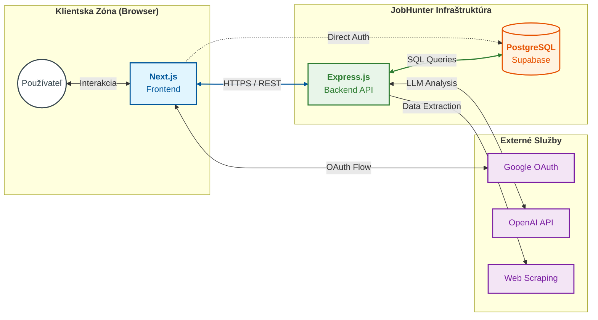

```mermaid
graph LR
    %% Definícia štýlov
    classDef client fill:#e1f5fe,stroke:#01579b,stroke-width:2px,color:#01579b;
    classDef core fill:#e8f5e9,stroke:#2e7d32,stroke-width:2px,color:#2e7d32;
    classDef storage fill:#fff3e0,stroke:#e65100,stroke-width:2px,color:#e65100;
    classDef external fill:#f3e5f5,stroke:#7b1fa2,stroke-width:2px,color:#7b1fa2;
    classDef user fill:#ffffff,stroke:#37474f,stroke-width:2px,color:#37474f;

    subgraph Client ["<b>Klientska Zóna (Browser)</b>"]
        direction LR
        U((Používateľ)):::user
        FE[<b>Next.js</b><br/>Frontend]:::client
    end

    subgraph Infrastructure ["<b>JobHunter Infraštruktúra</b>"]
        direction TB
        BE[<b>Express.js</b><br/>Backend API]:::core
        DB[(<b>PostgreSQL</b><br/>Supabase)]:::storage
    end

    subgraph Services ["<b>Externé Služby</b>"]
        direction TB
        Google[Google OAuth]:::external
        OpenAI[OpenAI API]:::external
        Web[Web Scraping]:::external
    end

    %% Flowy
    U <-->|Interakcia| FE
    FE <-->|HTTPS / REST| BE
    FE -.->|Direct Auth| DB
    BE <-->|SQL Queries| DB
    
    %% Externé linky
    FE <-->|OAuth Flow| Google
    BE <-->|LLM Analysis| OpenAI
    BE -->|Data Extraction| Web

    %% Legenda / Poznámky
    linkStyle 1 stroke:#01579b,stroke-width:2px;
    linkStyle 3 stroke:#2e7d32,stroke-width:2px;
```
