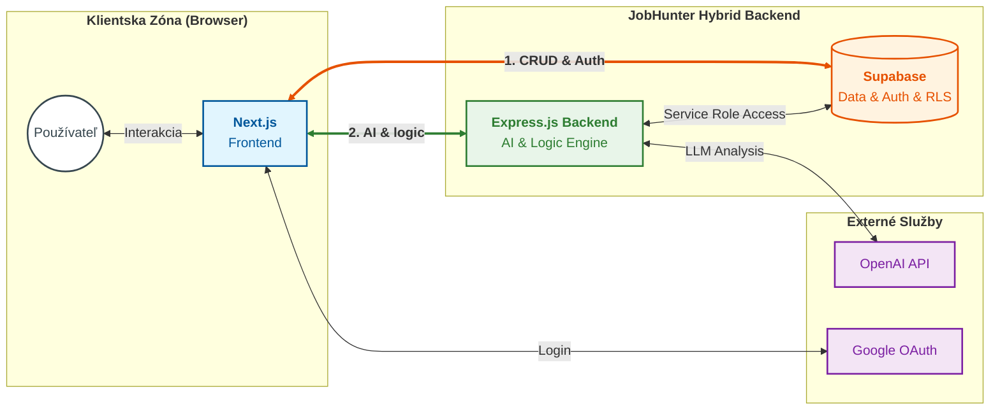

```mermaid
graph LR
    %% Definícia štýlov
    classDef client fill:#e1f5fe,stroke:#01579b,stroke-width:2px,color:#01579b;
    classDef core fill:#e8f5e9,stroke:#2e7d32,stroke-width:2px,color:#2e7d32;
    classDef storage fill:#fff3e0,stroke:#e65100,stroke-width:2px,color:#e65100;
    classDef external fill:#f3e5f5,stroke:#7b1fa2,stroke-width:2px,color:#7b1fa2;
    classDef user fill:#ffffff,stroke:#37474f,stroke-width:2px,color:#37474f;

    subgraph ClientZone ["<b>Klientska Zóna (Browser)</b>"]
        direction LR
        U((Používateľ)):::user
        FE[<b>Next.js</b><br/>Frontend]:::client
    end

    subgraph Infrastructure ["<b>JobHunter Hybrid Backend</b>"]
        direction TB
        BE[<b>Express.js Backend</b><br/>AI & Logic Engine]:::core
        DB[(<b>Supabase</b><br/>Data & Auth & RLS)]:::storage
    end

    subgraph ExternalServices ["<b>Externé Služby</b>"]
        direction TB
        OpenAI[OpenAI API]:::external
        Google[Google OAuth]:::external
    end

    %% Komunikačné flowy
    U <-->|Interakcia| FE
    
    %% HYBRID FLOW
    FE <-->|<b>1. CRUD & Auth</b>| DB
    FE <-->|<b>2. AI & logic</b>| BE
    
    %% Backend - DB connections
    BE <-->|Service Role Access| DB
    
    %% Externé
    FE <-->|Login| Google
    BE <-->|LLM Analysis| OpenAI

    %% Popisy flowov v diagrame
    linkStyle 1 stroke:#e65100,stroke-width:3px;
    linkStyle 2 stroke:#2e7d32,stroke-width:3px;
```
