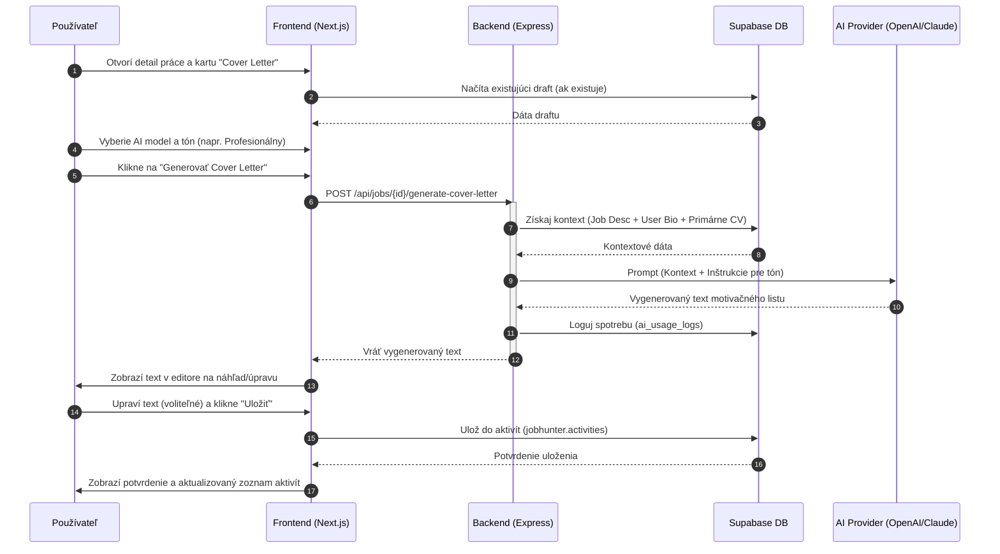

```mermaid
sequenceDiagram
    autonumber
    participant U as Používateľ
    participant FE as Frontend (Next.js)
    participant BE as Backend (Express)
    participant DB as Supabase DB
    participant AI as AI Provider (OpenAI/Claude)

    U->>FE: Otvorí detail práce a kartu "Cover Letter"
    FE->>DB: Načíta existujúci draft (ak existuje)
    DB-->>FE: Dáta draftu
    
    U->>FE: Vyberie AI model a tón (napr. Profesionálny)
    U->>FE: Klikne na "Generovať Cover Letter"
    
    FE->>BE: POST /api/jobs/{id}/generate-cover-letter
    activate BE
    
    BE->>DB: Získaj kontext (Job Desc + User Bio + Primárne CV)
    DB-->>BE: Kontextové dáta
    
    BE->>AI: Prompt (Kontext + Inštrukcie pre tón)
    AI-->>BE: Vygenerovaný text motivačného listu
    
    BE->>DB: Loguj spotrebu (ai_usage_logs)
    BE-->>FE: Vráť vygenerovaný text
    deactivate BE

    FE->>U: Zobrazí text v editore na náhľad/úpravu
    
    U->>FE: Upraví text (voliteľné) a klikne "Uložiť"
    FE->>DB: Ulož do aktivít (jobhunter.activities)
    DB-->>FE: Potvrdenie uloženia
    
    FE->>U: Zobrazí potvrdenie a aktualizovaný zoznam aktivít
```
