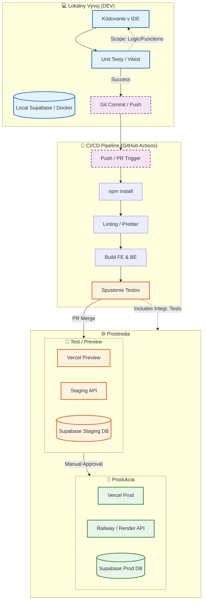

```mermaid
graph TD
    %% Definícia štýlov
    classDef dev fill:#e3f2fd,stroke:#1565c0,stroke-width:2px;
    classDef test fill:#fff3e0,stroke:#e65100,stroke-width:2px;
    classDef prod fill:#e8f5e9,stroke:#2e7d32,stroke-width:2px;
    classDef action fill:#f3e5f5,stroke:#7b1fa2,stroke-width:2px,stroke-dasharray: 5 5;

    subgraph Local ["💻 Lokálny Vývoj (DEV)"]
        direction TB
        Code[Kódovanie v IDE]:::dev
        UT[Unit Testy / Vitest]:::dev
        LocalDB[(Local Supabase / Docker)]:::dev
        Code --> UT
        UT -->|Success| Commit[Git Commit / Push]:::action
    end

    subgraph CICD ["🚀 CI/CD Pipeline (GitHub Actions)"]
        direction TB
        Trigger[Push / PR Trigger]:::action
        Install[npm install]
        Lint[Linting / Prettier]
        Build[Build FE & BE]
        RunTests[Spustenie Testov]:::test
        
        Trigger --> Install --> Lint --> Build --> RunTests
    end

    subgraph Environments ["🌐 Prostredia"]
        direction LR
        
        subgraph Staging ["🧪 Test / Preview"]
            SFE[Vercel Preview]:::test
            SBE[Staging API]:::test
            SDB[(Supabase Staging DB)]:::test
        end

        subgraph Production ["💎 Produkcia"]
            PFE[Vercel Prod]:::prod
            PBE[Railway / Render API]:::prod
            PDB[(Supabase Prod DB)]:::prod
        end
    end

    %% Propojenie flowu
    Commit --> Trigger
    RunTests -->|PR Merge| Staging
    Staging -->|Manual Approval| Production

    %% Popisky k testom
    UT -.->|Scope: Logic/Functions| Code
    RunTests -.->|Includes Integr. Tests| Environments
```
