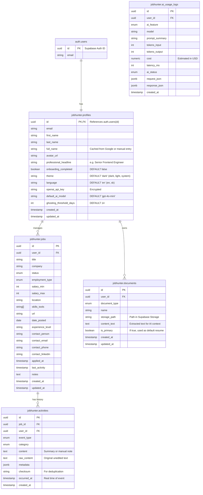

```mermaid
erDiagram
    "auth.users" ||--|| "jobhunter.profiles" : "has"
    "jobhunter.profiles" ||--o{ "jobhunter.jobs" : "manages"
    "jobhunter.profiles" ||--o{ "jobhunter.documents" : "owns"
    "jobhunter.jobs" ||--o{ "jobhunter.activities" : "has history"
    
    "auth.users" {
        uuid id PK "Supabase Auth ID"
        string email
    }

    "jobhunter.profiles" {
        uuid id PK, FK "References auth.users(id)"
        string email
        string first_name
        string last_name
        string full_name "Cached from Google or manual entry"
        string avatar_url
        string professional_headline "e.g. Senior Frontend Engineer"
        boolean onboarding_completed "DEFAULT false"
        string theme "DEFAULT 'dark' (dark, light, system)"
        string language "DEFAULT 'en' (en, sk)"
        string openai_api_key "Encrypted"
        string default_ai_model "DEFAULT 'gpt-4o-mini'"
        int ghosting_threshold_days "DEFAULT 14"
        timestamp created_at
        timestamp updated_at
    }

    "jobhunter.jobs" {
        uuid id PK
        uuid user_id FK
        string title
        string company
        enum status
        enum employment_type
        int salary_min
        int salary_max
        string location
        string[] skills_tools
        string url
        date date_posted
        string experience_level
        string contact_person
        string contact_email
        string contact_phone
        string contact_linkedin
        timestamp applied_at
        timestamp last_activity
        text notes
        timestamp created_at
        timestamp updated_at
    }

    "jobhunter.activities" {
        uuid id PK
        uuid job_id FK
        uuid user_id FK
        enum event_type
        enum category
        text content "Summary or manual note"
        text raw_content "Original unedited text"
        jsonb metadata
        string checksum "For deduplication"
        timestamp occurred_at "Real time of event"
        timestamp created_at
    }


    "jobhunter.documents" {
        uuid id PK
        uuid user_id FK
        enum document_type
        string name
        string storage_path "Path in Supabase Storage"
        text content_text "Extracted text for AI context"
        boolean is_primary "If true, used as default resume"
        timestamp created_at
        timestamp updated_at
    }

    "jobhunter.ai_usage_logs" {
        uuid id PK
        uuid user_id FK
        enum ai_feature
        string model
        string prompt_summary
        int tokens_input
        int tokens_output
        numeric cost "Estimated in USD"
        int latency_ms
        enum ai_status
        jsonb request_json
        jsonb response_json
        timestamp created_at
    }
```
