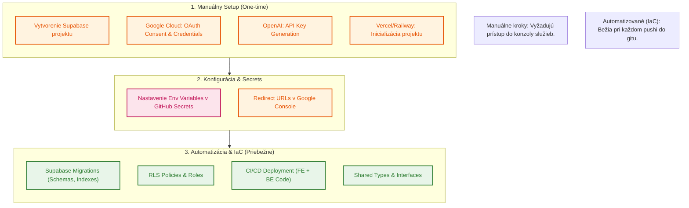

# 🏗️ Infrastructure: Manual vs. Automated (IaC)

Tento diagram znázorňuje rozdelenie zodpovedností pri nastavovaní prostredia. Cieľom je maximalizovať automatizáciu (IaC), zatiaľ čo kritické bezpečnostné a platformové kroky zostávajú pod manuálnou kontrolou.

### Podrobný rozpis

| Komponent | Typ | Čo konkrétne? |
| :--- | :--- | :--- |
| **Infraštruktúra** | **Manuálne** | Založenie účtov, vytvorenie projektov v cloude, pridanie platobnej karty. |
| **Databáza** | **IaC** | Definícia tabuliek (`jobs`, `activities`), migračné skripty v repozitári. |
| **Bezpečnosť (RLS)** | **IaC** | Pravidlá pre prístup k dátam definované v SQL skriptoch. |
| **Auth** | **Hybrid** | **Manuálne:** Setup v Google/Supabase. **IaC:** Implementácia v kóde. |
| **API Kľúče** | **Manuálne** | Vygenerovanie a bezpečné uloženie do environment premenných. |
| **Deployment** | **IaC** | GitHub Actions automaticky buildne a nasadí FE aj BE. |
