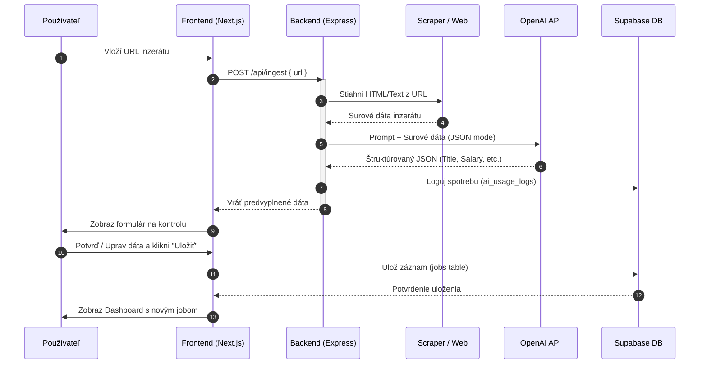

```mermaid
sequenceDiagram
    autonumber
    participant U as Používateľ
    participant FE as Frontend (Next.js)
    participant BE as Backend (Express)
    participant SCR as Scraper / Web
    participant AI as OpenAI API
    participant DB as Supabase DB

    U->>FE: Vloží URL inzerátu
    FE->>BE: POST /api/ingest { url }
    
    activate BE
    BE->>SCR: Stiahni HTML/Text z URL
    SCR-->>BE: Surové dáta inzerátu
    
    BE->>AI: Prompt + Surové dáta (JSON mode)
    AI-->>BE: Štruktúrovaný JSON (Title, Salary, etc.)
    
    BE->>DB: Loguj spotrebu (ai_usage_logs)
    BE-->>FE: Vráť predvyplnené dáta
    deactivate BE

    FE->>U: Zobraz formulár na kontrolu
    U->>FE: Potvrď / Uprav dáta a klikni "Uložiť"
    
    FE->>DB: Ulož záznam (jobs table)
    DB-->>FE: Potvrdenie uloženia
    FE->>U: Zobraz Dashboard s novým jobom
```
