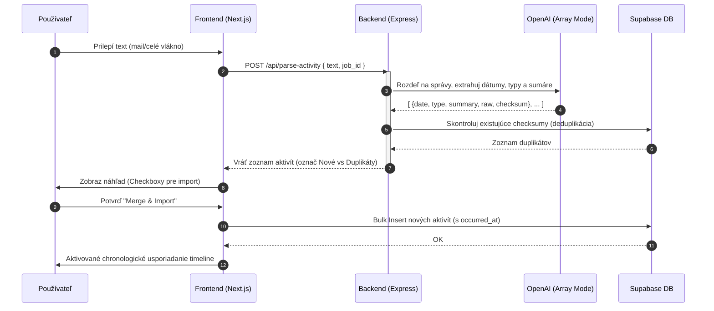

```mermaid
sequenceDiagram
    autonumber
    participant U as Používateľ
    participant FE as Frontend (Next.js)
    participant BE as Backend (Express)
    participant AI as OpenAI (Array Mode)
    participant DB as Supabase DB

    U->>FE: Prilepí text (mail/celé vlákno)
    FE->>BE: POST /api/parse-activity { text, job_id }
    
    activate BE
    BE->>AI: Rozdeľ na správy, extrahuj dátumy, typy a sumáre
    AI-->>BE: [ {date, type, summary, raw, checksum}, ... ]
    
    BE->>DB: Skontroluj existujúce checksumy (deduplikácia)
    DB-->>BE: Zoznam duplikátov
    
    BE-->>FE: Vráť zoznam aktivít (označ Nové vs Duplikáty)
    deactivate BE

    FE->>U: Zobraz náhľad (Checkboxy pre import)
    U->>FE: Potvrď "Merge & Import"
    
    FE->>DB: Bulk Insert nových aktivít (s occurred_at)
    DB-->>FE: OK
    FE->>U: Aktivované chronologické usporiadanie timeline
```

