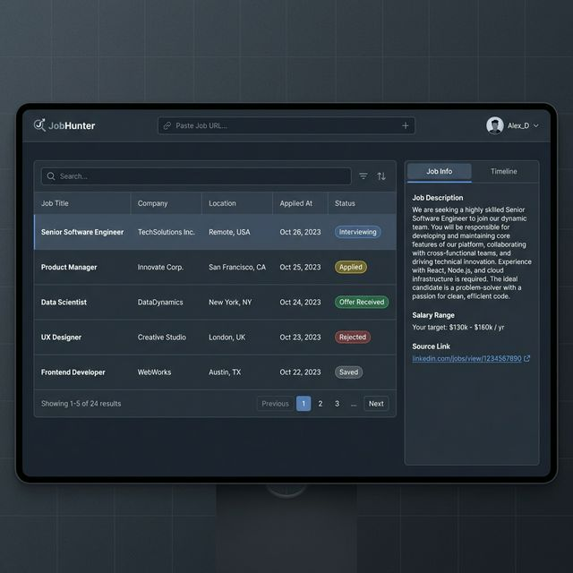

# 🎨 JobHunter - UI/UX Design



## 1. Design Philosophy
- **Style:** Clean, Professional, "Linear-like" aesthetics.
- **Theme:** Dark Mode by default (developer focused).
- **Focus:** Data density with readability. rigidity.

## 2. Color Palette (Tailwind)
Using `slate` for neutrals and `indigo` for primary actions.

| Role | Color Class | Hex | Usage |
| :--- | :--- | :--- | :--- |
| **Background** | `bg-slate-950` | `#020617` | Main app background |
| **Surface** | `bg-slate-900` | `#0f172a` | Panels, Cards, Sidebar |
| **Border** | `border-slate-800` | `#1e293b` | Dividers, Inputs |
| **Primary** | `bg-indigo-600` | `#4f46e5` | Primary buttons, Active states |
| **Text Main** | `text-slate-50` | `#f8fafc` | Headings, Primary text |
| **Text Muted** | `text-slate-400` | `#94a3b8` | Metadata, Secondary text |
| **Accents** | `green-500` (Offer), `red-500` (Rejected), `amber-500` (Interview) | | Status Badges |

## 3. Layout Structure (2-Column Interface)
```
[           Top Header Bar (Logo + Input + Profile)           ]
|-------------------------------------------------------------|
| [ Main Content (Job Table)        ] [ Detail Panel (Right) ]|
| [ Rows...                         ] [ Job Info | Timeline  ]|
| [ Rows...                         ] [ Activity Stream...   ]|
| [ Pagination...                   ] [                      ]|
```

> **Navigation:** Sidebar REMOVED. Links (Dashboard, Settings, Analytics) are now in the **User Profile Dropdown**.

> **Analytics Note:** Future feature to show "Applications per week" and "Success Rate". For MVP, this can be hidden or show simple stats.

## 4. Key Components

### 4.1 Header & Navigation
- **Structure:** Full width `h-16`.
- **Left:** Logo (JobHunter).
- **Center:** `[ Paste URL... ]` Input (Large width).
- **Right:** User Avatar.
  - **Dropdown Menu:**
    - Profile
    - Settings
    - Analytics (Future)
    - Logout

### 4.2 Job Table (Center Pane)
- **Top Toolbar:**
  - **Left:** Fulltext Search Input (`Search roles, companies...`).
  - **Right:** Filter Buttons (Status, Date).
- **Column Order:**
  1.  **Job Title** (Bold, Primary white)
  2.  **Company** (Muted)
  3.  **Location** (Text)
  4.  **Applied At** (Date, e.g. "Oct 24")
  5.  **Status** (Badge, Right-aligned)
- **Features:**
  - **Sortable:** Click on column headers to sort (ASC/DESC).
  - **Pagination:** Footer with "Previous | Page X of Y | Next".
- **Status Badges:**
  - **Shape:** Almost square (`rounded-sm` or `rounded-md`), **Fixed Width** (e.g., `w-28`) for alignment.
  - **Style:** Subtle border + colored text/bg (not full pill).
- **Rows:** Dense, clickable.

### 4.3 Detail Panel (Right Pane)
Permanent column (when a job is selected).
- **Header:** Title, Company, Status Selector.
- **Tabs (Order):**
  1.  **Job Info (Default):** Description, Salary, Location, Original Link.
  2.  **Timeline:** Activity history (Emails, Notes).
- **UX:** Can be toggled fullscreen or closed.

### 4.4 Pagination & Controls
- **Pagination:** Sticky footer in table area. Simple "Prev / Next" with "Page X of Y".
- **Sorting:** Columns have interactive headers.

## 5. Screen Definitions (Draft)
List of screens to be designed/implemented:

1.  **Dashboard (Main Screen):**
    - *Status:* Designed (see Mockup v5).
    - *Components:* Sidebar, Job Table, Quick Add, Detail Panel.
2.  **Login / Auth:**
    - *Status:* To be designed.
    - *Concept:* Minimal centered card, "Sign in with Google", Logo.
3.  **Settings:**
    - *Status:* Designed (see `docs/mockups/settings_appearance.png` or `docs/mockups/settings_appearance.html`).
    - *Sections:* Profile, API Keys, Export Data, Appearance.
4.  **Job Detail (Fullscreen - Optional):**
    - *Status:* Low priority (Side panel covers 90% use cases).
    - *Concept:* Only if timeline gets too long.
